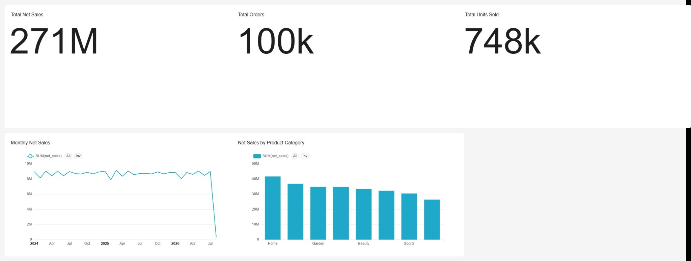
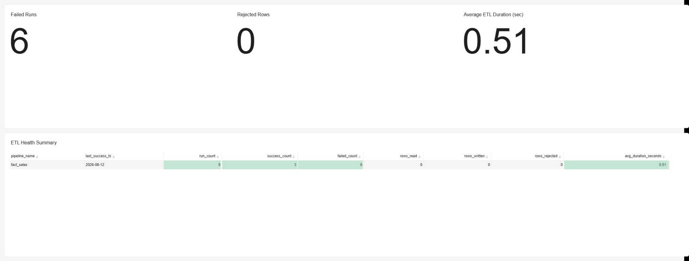

# End-to-End Retail Data Engineering Platform

A containerized portfolio project that implements an end-to-end retail analytics platform using **MariaDB, Apache Hop, MinIO, PostgreSQL, Apache Superset, Docker, and Python**.

The project goes beyond moving data from A to B: it demonstrates dimensional modeling, SCD Type 2 processing, incremental watermark loading, a captured upper bound, data-quality quarantine, ETL audit logging, failure-safe checkpoint advancement, idempotent reruns, object-storage landing, and business/operations analytics.

> This repository began as a local data-engineering lab and was extended with working Apache Hop pipelines, workflow orchestration, incremental-load controls, MinIO ingestion, validation tests, and Superset dashboards.

## Architecture

```text
                        Retail Data Platform

  MariaDB / OLTP                         MinIO / Data Lake
  source_db                              raw / curated / rejects
      |                                         ^
      |                                         |
      +------------------+----------------------+
                         |
                         v
                    Apache Hop
              ETL + orchestration + DQ
                 /                 \
                v                   v
      PostgreSQL Warehouse      Reject / Audit Controls
      dw.dim_* + fact_sales     control.*
                |
                v
          Apache Superset
      Business + ETL monitoring
```

### Local-to-AWS concept mapping

| Local component | Cloud concept practiced |
|---|---|
| MariaDB | RDS / Aurora source ingestion |
| MinIO | Amazon S3 raw/curated object storage |
| PostgreSQL | Analytical warehouse / Redshift-style modeling concepts |
| Apache Hop | AWS Glue-style ETL and workflow orchestration |
| Apache Superset | QuickSight-style BI consumption |
| Docker Compose | Containerized service orchestration |
| `.env` | Externalized secrets/configuration |

## What I implemented

### Warehouse modeling
- `dim_date` pipeline
- `dim_product` pipeline
- SCD Type 2 `dim_customer` pipeline
- `fact_sales` pipeline with surrogate-key lookups and derived measures

### Reliable incremental ETL
The sales load uses two bounds:

```text
SALES_WATERMARK      = last successfully committed source timestamp
SALES_WATERMARK_END  = source upper bound captured before the batch

Read source rows where:
updated_at > SALES_WATERMARK
AND updated_at <= SALES_WATERMARK_END
```

The workflow advances the persisted watermark **only after the fact pipeline succeeds**. A failed run therefore remains retryable instead of silently skipping source records.

### Data quality and observability
- Invalid quantities are routed away from the fact table.
- Reject records capture the source key, source entity, rule, reason, and rejection timestamp.
- Workflow audit actions record execution outcomes.
- ETL-health reporting is exposed through `control.v_etl_health`.

### Object storage
`raw_sales_to_minio.hpl` extracts source-oriented sales data and writes it to:

```text
lablake:///raw/retail/sales_raw.csv
```

The tested extract wrote **249,419 rows** to MinIO.

## Validation performed

The implementation was tested with controlled valid/invalid records and repeated workflow execution.

| Test | Result |
|---|---|
| Valid sales row | Loaded to `dw.fact_sales` |
| Invalid quantity row | Routed to `control.data_quality_rejects` |
| Failed ETL run | Watermark did not advance |
| Successful ETL run | Watermark advanced to captured upper bound |
| No-new-data rerun | No duplicate fact or reject records |
| Raw MinIO extract | 249,419 rows written successfully |

This explicitly tests **failure recovery and idempotency**, not only the happy path.

## Business dashboard



The Executive Sales dashboard presents:
- **271M** total net sales
- **100k** distinct orders
- **748k** units sold
- monthly net-sales trend
- net sales by product category

> Dashboard values are generated from synthetic lab data and are intended to demonstrate the engineering/analytics workflow, not real business performance.

## ETL / data-quality dashboard



The Operations/Data Quality dashboard exposes pipeline health, failed development/test runs, rejected-row metrics, average duration, and an ETL health summary. Failed-run counts shown in the screenshot include intentional development/debug executions used to validate failure handling.

## Apache Hop assets

```text
hop-project/
├── pipelines/
│   ├── dim_date.hpl
│   ├── dim_product.hpl
│   ├── dim_customer.hpl
│   ├── fact_sales.hpl
│   ├── get_sales_watermark.hpl
│   ├── get_sales_upper_bound.hpl
│   └── raw_sales_to_minio.hpl
└── workflows/
    ├── wf_fact_sales_audit.hwf
    └── wf_raw_ingestion.hwf
```

The Hop files contain no embedded passwords; runtime connections are configured through the local Hop project/environment.

## Repository structure

```text
.
├── docker-compose.yml
├── .env.example
├── docs/
│   ├── INSTALLATION_GUIDE.md
│   ├── LAB_CHECKLIST.md
│   ├── PROJECT_STATUS.md
│   └── screenshots/
├── hop-project/
│   ├── pipelines/
│   └── workflows/
├── scripts/
├── sql/
│   ├── mariadb/
│   └── postgres/
├── superset/
└── datasets/
```

## Run locally

Detailed clean-machine instructions are in [`docs/INSTALLATION_GUIDE.md`](docs/INSTALLATION_GUIDE.md).

Quick start:

```bash
cp .env.example .env
# Replace every example credential in .env

docker compose config
docker compose up -d --build
docker compose ps
```

Default local endpoints are documented in the installation guide. JDBC drivers are intentionally not committed; see `drivers/README.md`.

## Security / public-repository notes

- `.env` is ignored; only `.env.example` is committed.
- JDBC binaries are ignored.
- Generated datasets and local runtime artifacts are ignored.
- Example credentials **must be replaced** before running the stack.
- Do not commit Superset exports or Hop metadata containing real credentials without reviewing them first.

## Skills demonstrated

`Data Engineering` · `ETL/ELT` · `Apache Hop` · `PostgreSQL` · `MariaDB` · `MinIO/S3` · `Apache Superset` · `Docker` · `Dimensional Modeling` · `SCD Type 2` · `Incremental Loading` · `Watermarking` · `Data Quality` · `ETL Observability` · `SQL` · `Python`

## Next extensions

The included checklist also defines advanced exercises such as 500k/1M scale testing, `EXPLAIN (ANALYZE, BUFFERS)`, evidence-based indexing, Olist ingestion, large Parquet/MinIO work, and additional portfolio documentation. These are intentionally presented as **next steps**, not as completed work.

## Documentation

- [Installation Guide](docs/INSTALLATION_GUIDE.md)
- [Lab Checklist](docs/LAB_CHECKLIST.md)
- [Implemented Project Status](docs/PROJECT_STATUS.md)

## License

MIT — see [LICENSE](LICENSE).
